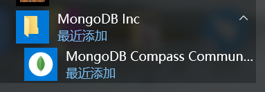
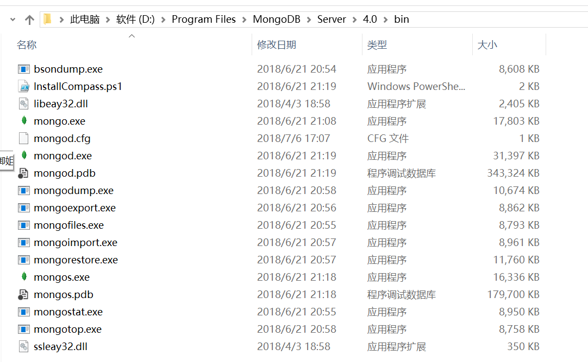
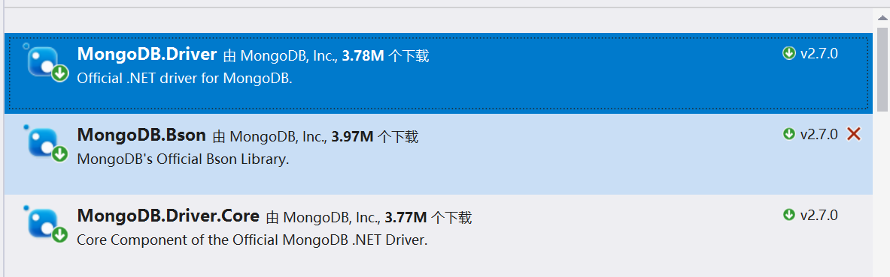

# Mongodb For CSharp

## 1.mongodb的安装

windows安装 mongodb ，可以在mongodb官网下载 msi格式的安装程序，但是官网貌似被屏蔽了，需要翻墙下载

下载安装后 同时也会安装一个客户端程序




安装完后的服务端 是在安装路劲下面的bit 文件夹




打开客户端，输入相应的IP、端口 ，账号密码即可登录


## 2..net 操作mongodb

通过nuget 安装驱动



安装第一**Driver** 的其他两个回默认安装，主要.netframework的版本要求


```
 string connectionStr = "mongodb://127.0.0.1:27017";//链接字符串
 MongoClient client = new MongoClient(connectionStr);//初始化 链接客户端
 IMongoDatabase client.GetDatabase("mydb")//初始化mydb 这个数据库
 IMongoCollection<BsonDocument> myCollection=mydb.GetCollection<BsonDocument>("mytb")//初始化Mydb下面mytb 这个数据集
 
```

查询数据集下面的 所有数据

```c#
FilterDefinitionBuilder<BsonDocument> builderFilter = Builders<BsonDocument>.Filter;
var result = myCollection.Find<BsonDocument>(builderFilter.Empty).ToList();
```


删除某个数据

```
//声明方法
public void Delete(FilterDefinition<BsonDocument> filter)
{
	var resut = myCollection.DeleteManyAsync(filter).Result;
}


//调用
var filter = Builders<BsonDocument>.Filter.Eq("wxid", "123");//删除wxid=123的数据
mongodb.Delete(filter);
```


插入数据

```
//调用
 var doc = new BsonDocument{
 	{ "wxid",username},
 	{ "obj",qrCodeObj.ToJson() }
 };

mongodb.Insert(doc);

//声明
public void Insert(BsonDocument doc)
{
	myCollection.InsertOneAsync(doc);
}
```


